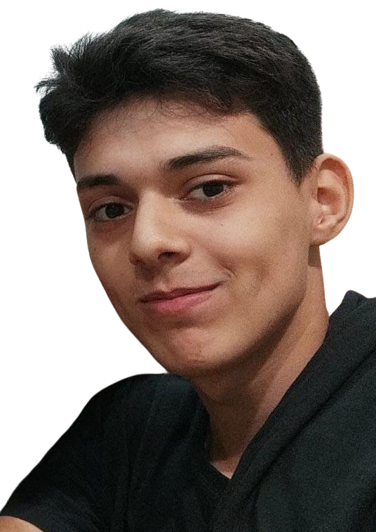

<h1 align="center">Portfólio Digital de Rafael dos Santos</h1>

<div align="center">
   <a href="https://github.com/FaelSantoss">
      
   </a>
   
   <a href="https://github.com/FaelSantoss/portfolio_digital/commits/main">
      
   </a>
</div>

<p align="center">
  
</p>

## Tecnologias Utilizadas

- Python
- Flask
- HTML
- CSS
- Tailwind CSS
- MySQL
- Docker

## Como Iniciar o Projeto

### Pré-Requisitos

Para rodar o projeto, você precisará das seguintes ferramentas:

- [Git](https://git-scm.com/)
- [Docker](https://docs.docker.com/get-docker/)

### Executando a Aplicação

```bash
# Clone este repositório
$ git clone https://github.com/FaelSantoss/portfolio_digital.git

# Acesse a pasta do projeto
$ cd portfolio_digital

# Inicie o container da aplicação
$ docker compose up
