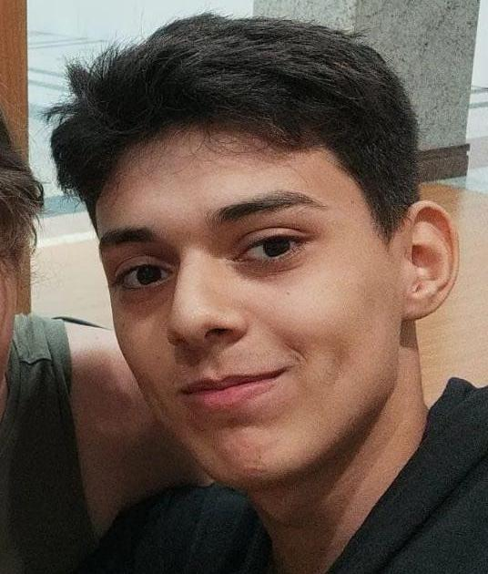

<h1 align="center">Portfólio digital de Rafael dos Santos</h1>

<h2 align="center">Orientador: Fabrício Galende Marques de Carvalho</h2>

<div align="center">
   <a href="https://github.com/FaelSantoss">
      
   </a>
   
   <a href="https://github.com/JohnPetros/unipetros/commits/main">
      
   </a>
  </a>
   </a>
    
</div>

<p align="center">
  
</p>

<section>
<h2>Tecnologias utilizadas:</h2>
✔️ Python

✔️ Flask

✔️ HTML

✔️ CSS

✔️ Tailwindcss

✔️ MySQL

✔️ Docker

</section>

## Como iniciar o projeto:

### Pré-requisitos

Para rodar o projeto será necessario ter instalado as seguintes ferramentas:

- [Git](https://git-scm.com/)
- [Docker](https://docs.docker.com/get-docker/)

### Rodando a aplicação

```bash

# Clone este repositório
$ git clone https://github.com/FaelSantoss/portfolio_digital.git

# Acesse a pasta do projeto
$ cd portfolio_digital

# Rode o container da aplicação
$ docker compose up
```
Validação do orientador. Fabrício Galende Marques de Carvalho.
